```{r setup, include=FALSE}
knitr::opts_chunk$set(echo = FALSE)
knitr::opts_chunk$set(message = FALSE)
library(knitr)
library(ggplot2)
library(dplyr)
library(mnormt)
library(circular)
```

## Statistics?

```{r, out.width = "900px"}
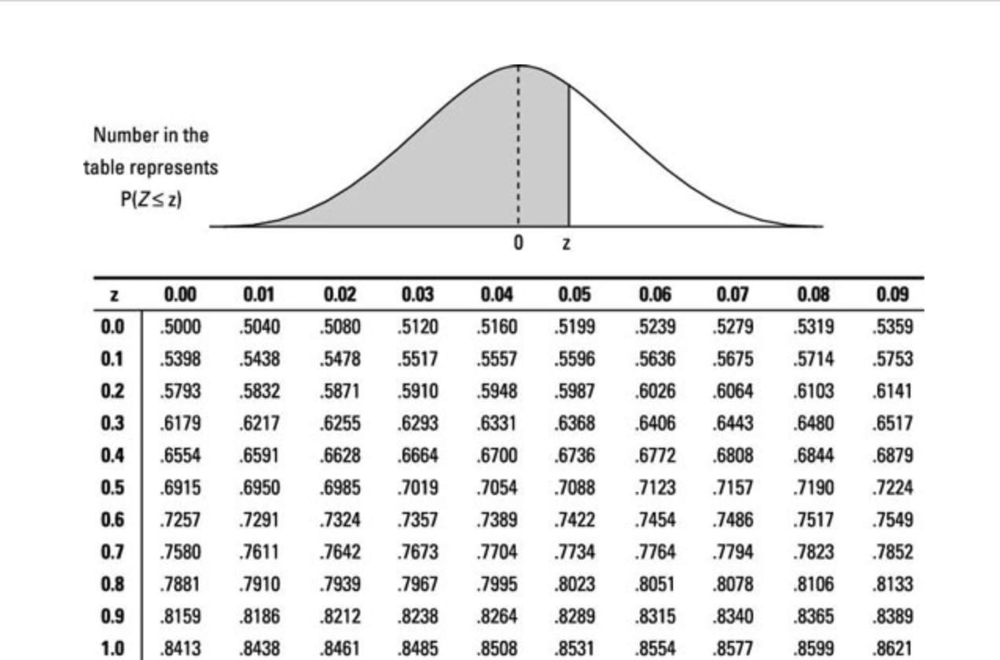
```

## Statistics?

```{r, out.width = "600px"}
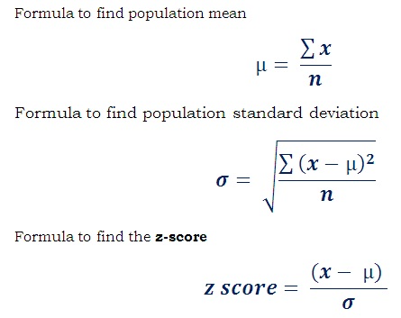
```


## Ending a Conversation (with Statistics)

```{r, out.width = "600px"}
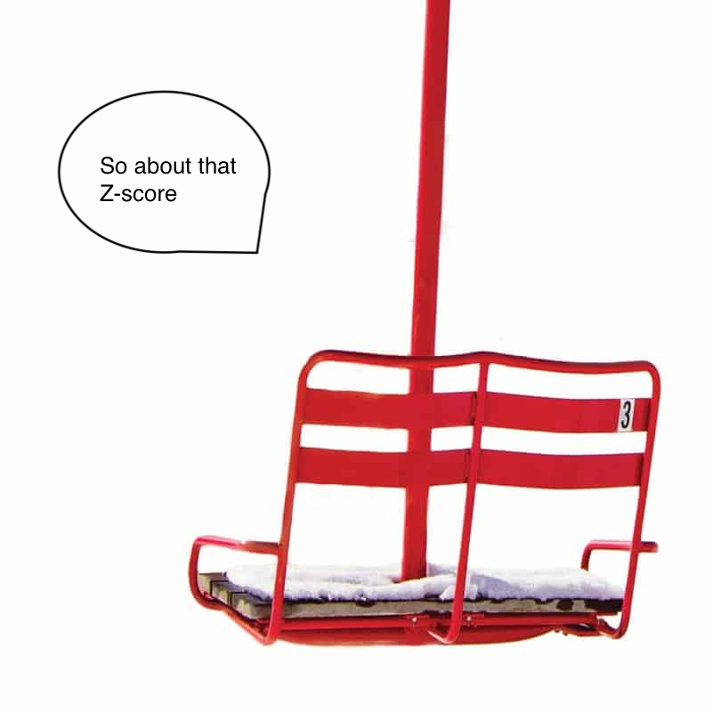
```


## Statistics?

```{r, out.width = "900px"}
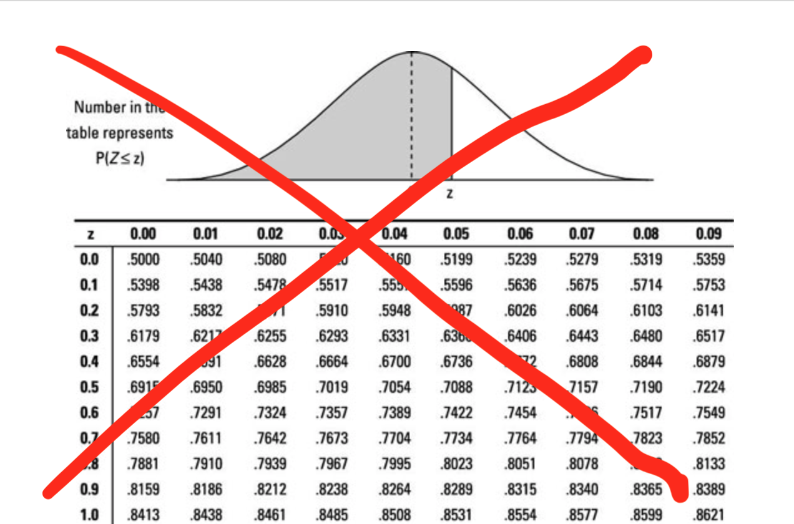
```

## Statistics?

```{r, out.width = "600px"}
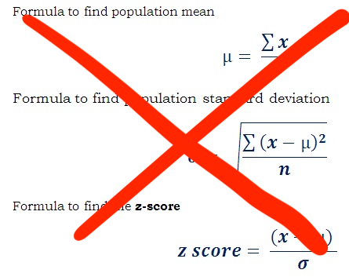
```


## Statistics

“The best thing about being a statistician is that you get to play in everyone’s backyard.” - John Tukey
```{r, out.width = "600px"}
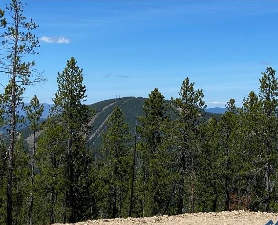
```


## Statistics

```{r, out.width = "800px"}
knitr::include_graphics("field.png")
```


## My Research Philosophy


Statistics serves as the interface for answering challenging scientific problems while collaborating with scientists:

>- Adam Sepulveda, US Geological Survey
>- Kathi Irvine, US Geological Survey
>- Frank van Manen & Mark Haroldson, US Geological Survey

## BEES

```{r, out.width = "1000px"}
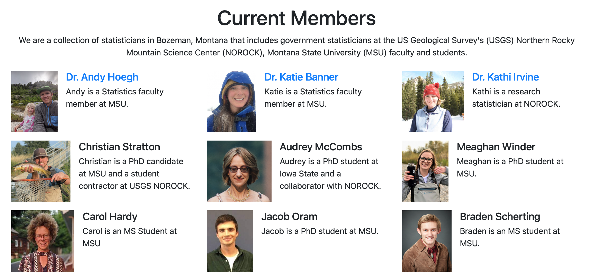
```

## Evaluating Zebra Mussels Detection and Monitoring

```{r, out.width = "600px"}
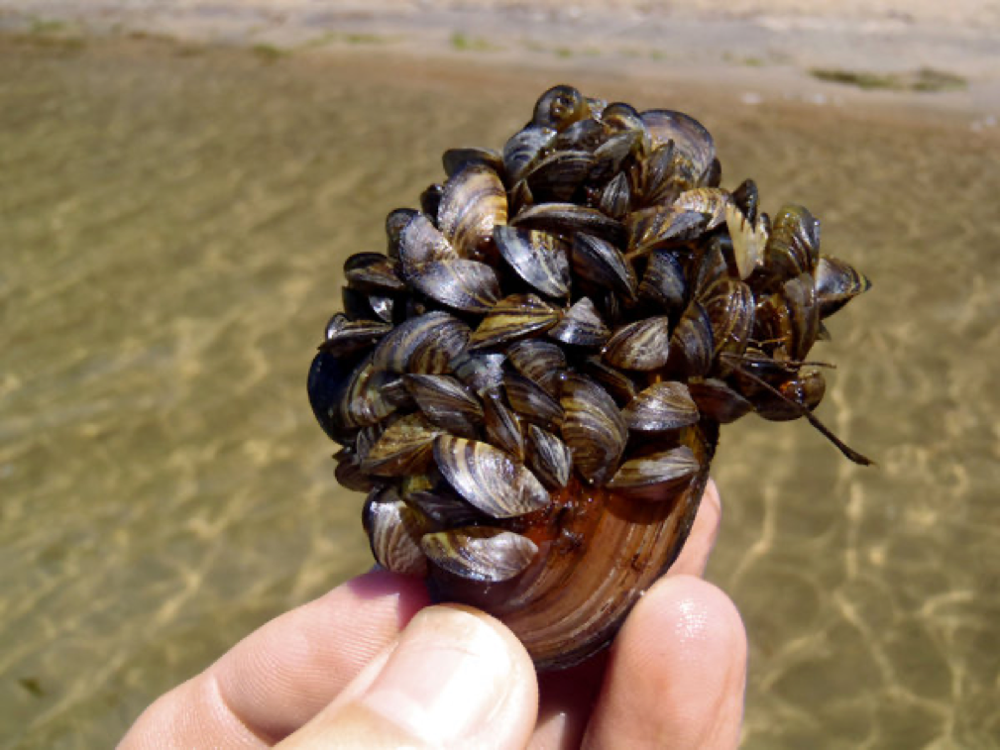
```

## EDNA Biosurveillance of Harmful Organisms and Invasive Species

```{r, out.width = "800px"}
knitr::include_graphics("https://bloximages.chicago2.vip.townnews.com/missoulian.com/content/tncms/assets/v3/editorial/1/26/12683bb0-f297-5d98-aad8-f08d34b7a683/57b73db33ce8d.image.jpg?resize=1200%2C783")
```


## Understanding Grizzly Bear Dispersal Behavior
```{r, out.width = "800px"}
knitr::include_graphics("https://www.nps.gov/yell/learn/nature/images/griz_sow.jpg?maxwidth=1200&maxheight=1200&autorotate=false")
```

## Understanding Climate Change Impacts on Plant Communities

```{r, out.width = "900px"}
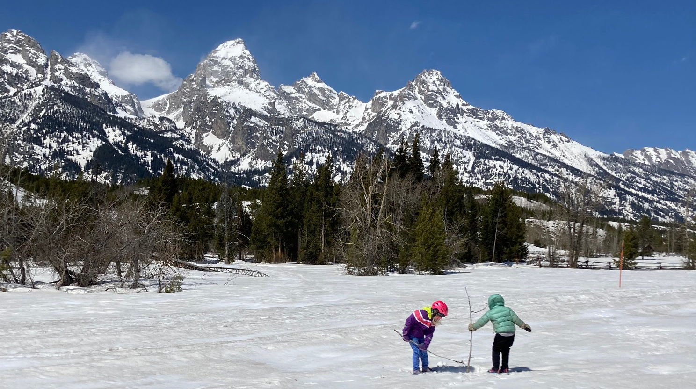
```


## Plankton Tows for Zebra Mussell Detection
### Meaghan Winder with Adam Sepuleveda
```{r, out.width = "300px"}
knitr::include_graphics("http://stopaquatichitchhikers.org/content/uploads/2016/10/quagga-and-zebra-mussels.jpg")
```

## Boat Inspection
```{r, out.width = "700px"}
knitr::include_graphics("https://mediad.publicbroadcasting.net/p/kufm/files/styles/large/public/201407/Boat_Check.jpg")
```


## Plankton Tows for Zebra Mussell Detection
```{r, out.width = "600px"}
knitr::include_graphics("https://vtwatershedblog.files.wordpress.com/2017/08/ais_internusingplanktonnettocollectsamples1.jpg")
```

## Research Problem

- Understand detection probability of current sampling efforts and implications on management decisions.

- Make recommendations for future management decisions.


# EDNA Biosurveillance for Harmful Organisms and Invasive Species

## EDNA Biosurveillance 
### Christian Stratton with Adam Sepulveda

```{r, out.width = "700px"}
knitr::include_graphics("https://bloximages.chicago2.vip.townnews.com/billingsgazette.com/content/tncms/assets/v3/editorial/b/2b/b2b0ff95-fb84-555d-9bfc-3a69a4dcce43/57b20b5e89ab0.image.jpg?resize=1200%2C783")
```


## Mountain Whitefish and PKD
```{r, out.width = "700px"}
knitr::include_graphics("https://www.nps.gov/yell/learn/nature/images/whitefish_ZacSexton.jpg?maxwidth=1200&maxheight=1200&autorotate=false")
```


## Research Problem

- Use robotic samplers with environmental DNA (eDNA) capability for real-time surveillance and near-term forecasting of aquatic invasive species and harmful organisms.

- This requires developing computationally-efficient spatiotemporal multiscale occupancy models.

## Environmental DNA

```{r, out.width = "700px"}
knitr::include_graphics("https://prd-wret.s3-us-west-2.amazonaws.com/assets/palladium/production/s3fs-public/styles/full_width/public/thumbnails/image/wss-qw-edna-diagram.png")
```


## Data Collection

```{r, out.width = "650px"}
knitr::include_graphics("Data.png")
```

## Occupancy Model Data Framework

- Presence Data: 
```{r, out.width = "50px"}
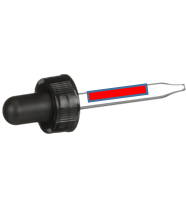
```
Species occurs in the region AND species is detected with eDNA
	
- Absence Data:
```{r, out.width = "50px"}

```
Species does not occur in the region OR species is not detected with eDNA.

- Detection Probability: Occupancy model accounts for probability of detecting organism when it is present.	

## Multiscale Occupancy Model

Two detection probabilities are necessary

1. probability of detecting eDNA in bottle, given it is present at site 
```{r, out.width = "50px"}

```

2. probability of detecting eDNA in the pipette, given it is in bottle 
```{r, out.width = "50px"}

```

## Robot Sampler
_Streaming_ data collection possible for environmental DNA using robot samplers.

```{r, out.width = "500px"}
knitr::include_graphics("https://pbs.twimg.com/media/D35OZMtWsAI69XX.jpg")
```


## Efficient Computation and Software
>- Polya-Gamma data augmentation permits Gibbs sampling (efficient MCMC) for logistic regression models.

- Spatial and temporal correlation modeled using dynamic linear models and Gaussian process extensions for Polya-Gamma latent variables, in progress.

- Software package available on github (`msocc`).

- R shiny app for sample size calculations and data visualization.


# Collective Animal Movement Models

## Movement Models for Grizzly Bears
```{r, out.width = "600px"}
knitr::include_graphics("https://www.nps.gov/yell/learn/nature/images/griz_sow.jpg?maxwidth=1200&maxheight=1200&autorotate=false")
```

with Frank Van Manen and Mark Haroldson

Previous work by Chris Peck and Jacob Dym


## {data-background-video="animation.mp4"}

## Research Problem: Expanding Grizzly Range
```{r, out.width = "800px"}
knitr::include_graphics("https://prd-wret.s3-us-west-2.amazonaws.com/assets/palladium/production/s3fs-public/styles/full_width/public/thumbnails/image/15-yr-window-1990-2018.gif")
```

## Research Problem

- Use historical telemetric data from individual grizzly bears to understand and model population dynamics.

- Grizzly bears establish a home range and can be territorial.

- Range expansion is typically a product of males (young or old) searching for their own home range.

## ANIMAL MOVEMENT MODELS

## Step Length and Angular Direction

- Step Length: is a distribution for distance traveled in a specific period

- Angular Direction:\
```{r, out.width = '400px', }
data.vm <- rvonmises(n=1000, mu=circular(0), kappa=3) 

# Plot data set. All points do not fit on plot.
plot(data.vm, stack=TRUE, bins=150, main = 'Histogram of Angular Data') 

```

## Step Length and Angular Direction

```{r, out.width = "900px"}
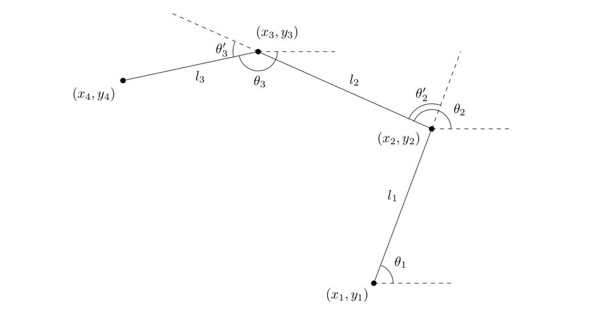
```


## Collective Movement

Collective animal movement refers to a situation where animals influence each others behavior.

Commonly, there are three types of behaviors considered

- Attraction
- Alignment
- Repulsion


## Agent Based Models

- Agent based models are a simulation based approach using a set of _agents_.
- Each agent is given a relatively simple set of rules, which control interactions between agents.
- The collective behavior of agents can model complex population level characteristics.

## Self Propelled Particles

_The only rule of the model is: at each time step a given particle driven with a constant absolute velocity assumes the average direction of motion of the particles in its neighborhood of radius r with some random perturbation added._ 

Vicsek, et. al 1995.

## Agent Properties for Grizzly Bears
The agents have a set of characteristics:

- movement speed
- angular heading
- home range affinity

Furthermore the characteristics will vary:

- based on a Markov switching model to determine whether the bear is dispersing


## Statistical Model Fitting
- Complex, collective movement models where agents interact pose challenges for parameter estimation.
- Parameters associated with the agent rules are estimated to allow for uncertainty in model parameters.

## Agent-Based Models as State Space Model
- We want to estimate model parameters, such as those in the probability distributions for step size and turning angle.

- However for each agent at a given time we also need to estimate a set of "state parameters":

    - step size for time t
    - turning angle for time t
    - agent location (x and y) coordinates

## Particle-MCMC

- Particle-MCMC combines particle-based methods with Markov Chain Monte Carlo

- A particle filter is used to propose the state variables in the MCMC framework

## Findings

- We found that the data supported the Markov switching model (based on proximity) as the bears tended to switch from an "home range state" to an "exploring state" with higher frequency when other bears were in the proximity.

- Stay tuned for where / when those bears might show up.

# 

```{r, out.width = "800px"}
knitr::include_graphics("https://upload.wikimedia.org/wikipedia/commons/e/ea/Thats_all_folks.svg")
```


# HIERARCHICAL SPATIO-TEMPORAL SPP MODEL

## Data Model

$$\underline{z}_{t} = H_t \underline{s}_{t} + \underline{\epsilon}_t, \; \; \;\;\;\; \underline{\epsilon}_t \sim N(0,\sigma^2_{\epsilon} I)$$
where $\underline{z}_t$ is a matrix of the observed locations for the agents at time t, $H_t$ is an incidence matrix to determine whether an agent is observed at time t, $\underline{s}_t$ is the latent location at time, and $\epsilon_t$ is the error process

## Process Model

$$\underline{s}_{i,t} = \underline{s}_{i,t-1} + u_{i,t}\underline{\delta}_{i,t} + \underline{\eta}_{i,t}$$

>- $u_{i,t}$ represents the speed
>- $\underline{\delta}_{i,t}$ is a unit vector for the directional component of the velocity

#### Angular Heading
$$\left(\delta_{x,i,t}, \delta_{y,i,t}\right)' = \left( \cos(\theta_{i,t}), \sin(\theta_{i,t}) \right)$$ 
$$\theta_{i,t}  \sim ProjNormal(\mu, \kappa)$$
>- $\mu$ is an angular heading and $\kappa$ is a concentration parameter

#### Speed
$$u_{i,t} = LN(\mu_u, \sigma^2_u)$$

