```{r setup, include=FALSE}
knitr::opts_chunk$set(echo = FALSE)
knitr::opts_chunk$set(message = FALSE)
library(knitr)
library(ggplot2)
library(dplyr)
library(mnormt)
library(circular)
```

## Statistics?

```{r, out.width = "600px"}
knitr::include_graphics("zscore.png")
```

## Statistics?

```{r, out.width = "900px"}
knitr::include_graphics("Z.png")
```


## Statistics?

```{r, out.width = "600px"}
knitr::include_graphics("chair.png")
```

## Ending a Conversation (with Statistics)

```{r, out.width = "600px"}
knitr::include_graphics("chair.png")
```


## Statistics?

```{r, out.width = "900px"}
knitr::include_graphics("Z2.png")
```

## Statistics?

```{r, out.width = "600px"}
knitr::include_graphics("zscore2.png")
```


## Statistics and Science

“The best thing about being a statistician is that you get to play in everyone’s backyard.” - John Tukey
```{r, out.width = "400px"}
knitr::include_graphics("GYE.png")
```

## Statistics and Science

```{r, out.width = "800px"}
knitr::include_graphics("water.png")
```

## Statistics and Science

```{r, out.width = "800px"}
knitr::include_graphics("field.png")
```


## Collaborative Science

Statistics serves as the interface for answering challenging scientific problems while collaborating with scientists:

>- Adam Sepulveda, US Geological Survey
>- Frank van Manen & Mark Haroldson, US Geological Survey
>- Kathi Irvine, US Geological Survey

## BEES

```{r, out.width = "1000px"}
knitr::include_graphics("BEES.png")
```
contact: andrew.hoegh@montana.edu

## Evaluating Zebra Mussel Monitoring

```{r, out.width = "600px"}
knitr::include_graphics("zebra.png")
```

## EDNA Biosurveillance 

```{r, out.width = "800px"}
knitr::include_graphics("https://bloximages.chicago2.vip.townnews.com/missoulian.com/content/tncms/assets/v3/editorial/1/26/12683bb0-f297-5d98-aad8-f08d34b7a683/57b73db33ce8d.image.jpg?resize=1200%2C783")
```


## Grizzly Bear Dispersal Behavior
```{r, out.width = "800px"}
knitr::include_graphics("https://www.nps.gov/yell/learn/nature/images/griz_sow.jpg?maxwidth=1200&maxheight=1200&autorotate=false")
```

## Climate Change Impacts on Plant Communities

```{r, out.width = "900px"}
knitr::include_graphics("Teton.png")
```


# Evaluating Zebra Mussel Monitoring

## Evaluating Zebra Mussel Monitoring
### Meaghan Winder with Adam Sepuleveda
```{r, out.width = "700px"}
knitr::include_graphics("https://mediad.publicbroadcasting.net/p/kufm/files/styles/large/public/201407/Boat_Check.jpg")
```

## Goal: evaluate current monitoring regime
```{r, out.width = "600px"}
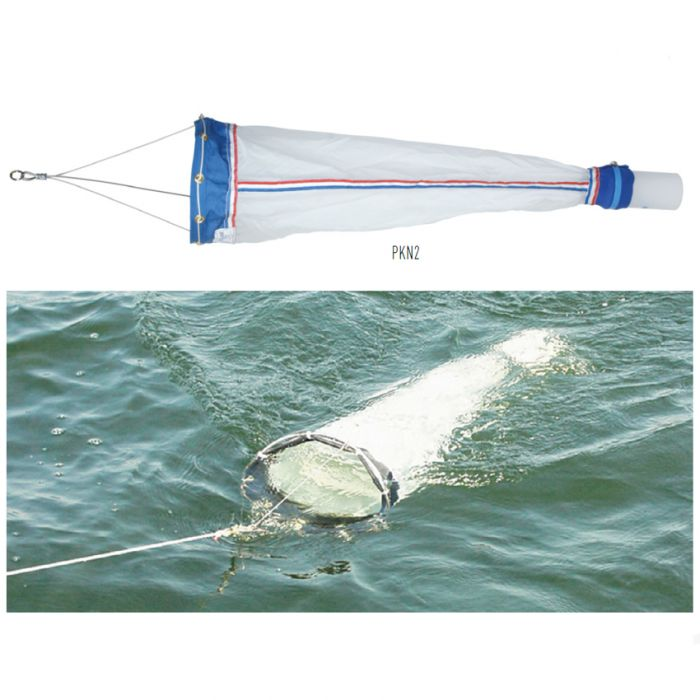
```

## Plankton Tows
```{r, out.width = "600px"}
knitr::include_graphics("tow.png")
```


## Plankton Tows: Samples

Do we think zebra mussels are present?

```{r, out.width = "100px"}
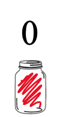
```

## Plankton Tows: Samples

Do we think zebra mussels are present?

```{r, out.width = "300px"}
knitr::include_graphics("samples1.png")
```

## Plankton Tows: Samples

How about now?

```{r, out.width = "600px"}
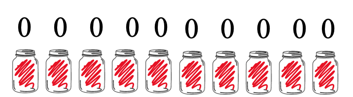
```

## Plankton Tows: Samples

```{r, out.width = "900px"}
knitr::include_graphics("samples3.png")
```

## Detection Probability

- In biological settings, many organisms are elusive or hard to detect
- Not identifying the organism does not mean it is not present
- Understanding _detection probability_ is essential for monitoring programs
- Statistics (occupancy models) can be used to estimate detection probability

## Detection Probability for Zebra Mussels

Depends on characteristics of the water body

```{r, out.width = "800px"}
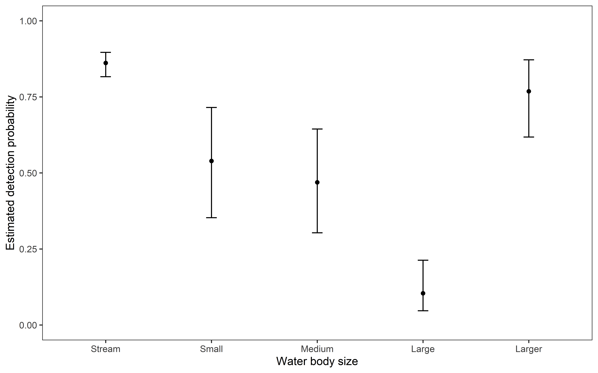
```

## Sampling Intensity

Almost certainly need to increase sampling intensity

```{r, out.width = "800px"}
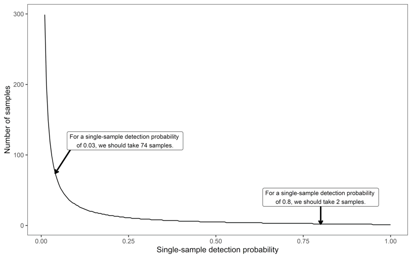
```

## Sampling Intensity

Testing samples from individual tows provides better estimate of detection probability

```{r, out.width = "800px"}
knitr::include_graphics("tow_data.png")
```


# EDNA Biosurveillance for Harmful Organisms and Invasive Species

## EDNA Biosurveillance 
### Christian Stratton with Adam Sepulveda

```{r, out.width = "600px"}
knitr::include_graphics("water2.png")
```


## Environmental DNA

```{r, out.width = "700px"}
knitr::include_graphics("https://prd-wret.s3-us-west-2.amazonaws.com/assets/palladium/production/s3fs-public/styles/full_width/public/thumbnails/image/wss-qw-edna-diagram.png")
```

## Goal: Develop computationally-efficient software for eDNA surveillance
```{r, out.width = "700px"}
knitr::include_graphics("https://www.nps.gov/yell/learn/nature/images/whitefish_ZacSexton.jpg?maxwidth=1200&maxheight=1200&autorotate=false")
```

## Data Collection

```{r, out.width = "650px"}
knitr::include_graphics("Data.png")
```

## EDNA Data Structure

>- Presence Data: 
```{r, out.width = "50px"}
knitr::include_graphics("positive.png")
```
Species occurs AND species is detected with eDNA
	
- Absence Data:
```{r, out.width = "50px"}
knitr::include_graphics("negative.png")
```
Species does not occur OR species is not detected with eDNA.

## Multiscale Occupancy Model

Two detection probabilities are necessary

>1. probability of detecting eDNA in bottle, given it is at site 
```{r, out.width = "50px"}
knitr::include_graphics("bottle.png")
```

2. probability of detecting eDNA in the pipette, given it is in bottle 
```{r, out.width = "50px"}
knitr::include_graphics("positive.png")
```

## Efficient Computation and Software
```{r, out.width = "1000px"}
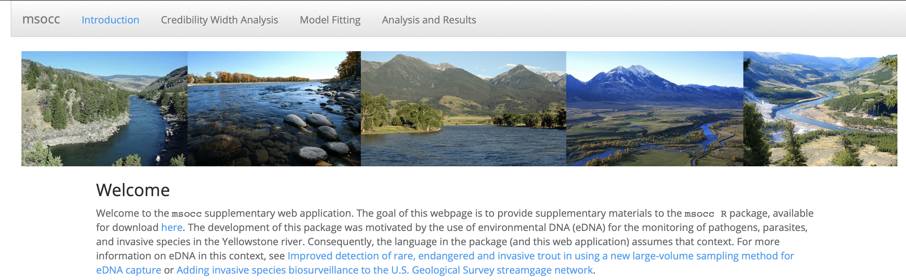
```

## Future Goals: _Streaming_ analysis

```{r, out.width = "500px"}
knitr::include_graphics("https://pbs.twimg.com/media/D35OZMtWsAI69XX.jpg")
```


# Understanding Grizzly Bear Dispersal Behavior

## Collective Movement Models for Grizzly Bears
```{r, out.width = "600px"}
knitr::include_graphics("https://www.nps.gov/yell/learn/nature/images/griz_sow.jpg?maxwidth=1200&maxheight=1200&autorotate=false")
```

with Frank Van Manen and Mark Haroldson

Previous work by Chris Peck and Jacob Dym


## Goal: Predict Expanding Grizzly Range
```{r, out.width = "800px"}
knitr::include_graphics("https://prd-wret.s3-us-west-2.amazonaws.com/assets/palladium/production/s3fs-public/styles/full_width/public/thumbnails/image/15-yr-window-1990-2018.gif")
```

## {data-background-video="animation.mp4"}


## Dispersal Dynamics

```{r, out.width = "600px"}
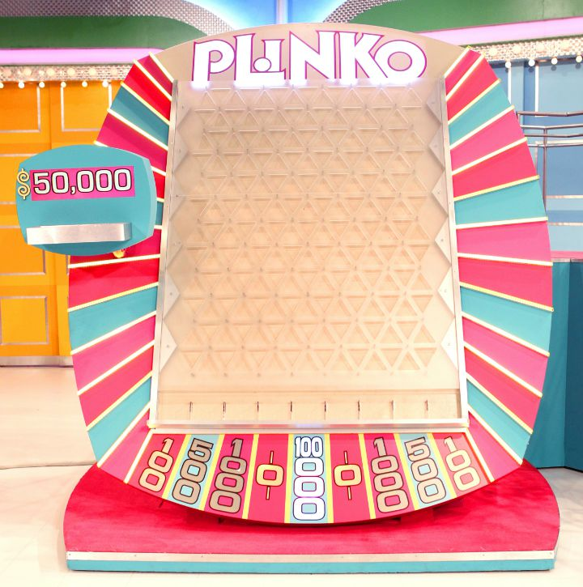
```

## Telemetric Data to Movement Modeling

```{r, out.width = "900px"}
knitr::include_graphics("turn_angle.png")
```


## Animal Movement Models

- Step Length: is a distribution for distance traveled in a specific period

- Angular Direction:\
```{r, out.width = '400px', }
data.vm <- rvonmises(n=1000, mu=circular(0), kappa=3) 

# Plot data set. All points do not fit on plot.
plot(data.vm, stack=TRUE, bins=150, main = 'Histogram of Angular Data') 

```

## Collective Movement and Agent Based Models

-Collective animal movement refers to a situation where animals influence each others behavior.

- Agent based models are a simulation based approach using a set of _agents_.
- Each agent is given a relatively simple set of rules, which control interactions between agents.
- The collective behavior of agents can model complex population level characteristics.


## Independent Model

```{r, out.width = "600px"}
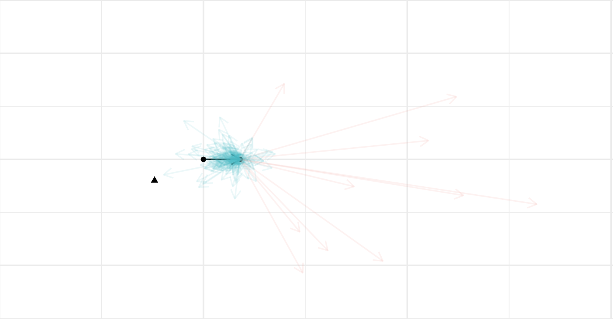
```

## Collective Model

```{r, out.width = "600px"}
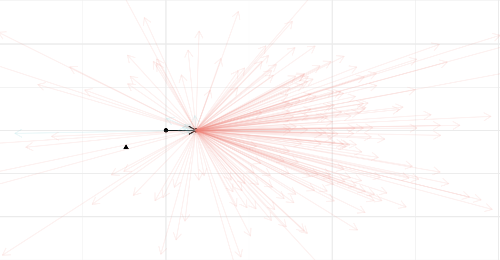
```


## Findings

- We found that bears tended to switch from an "home range state" to an "exploring state" when other bears were in the proximity.

- Still working to include spatial covariates


## Predictive Map (still to come)

```{r, out.width = "600px"}
knitr::include_graphics("notfound.png")
```

# Climate Change Impacts on Plant Communities

## Climate Monitoring in Grand Teton NP

```{r, out.width = "900px"}
knitr::include_graphics("Teton.png")
```

with Christian Stratton and Kathi Irvine

## Goal: Evaluate Monitoring Plan

```{r, out.width = "500px"}
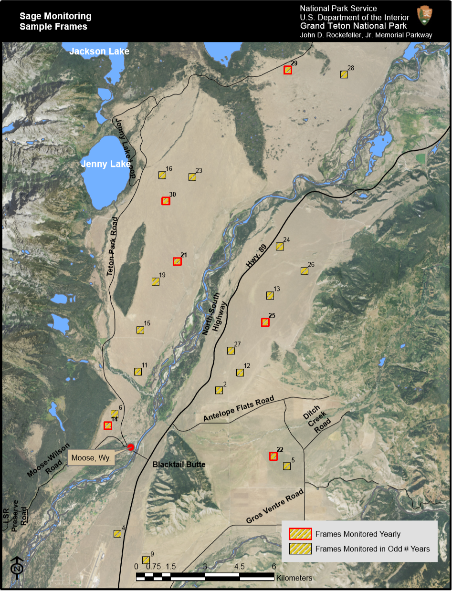
```

## Data collection

```{r, out.width = "500px"}
knitr::include_graphics("grid.png")
```

## Data structure

```{r, out.width = "900px"}
knitr::include_graphics("sage_data.png")
```


## Data Challenges

>- We are interested in detecting changes across time; however, _changes_ is difficult to describe.

- Changes would refer to comparisons across a set of grids with different species (60ish).

- Changes are not as simple as more or less of a specific species of sagebrush, but rather focuses on the composition of the community of plants.

## Sampling Effort Questions

- How often and how many frames need to be monitored?

- How to make comparisons between grids from different locations or times, given all of the different species?


## Projection and Clustering

```{r, out.width = "800px"}
knitr::include_graphics("ord.png")
```

## Monitoring Plan 

- Climate change related impacts will not be expected to vary dramatically from year-to-year

- The composition of plant species can be projected into lower dimension to assess similarity. Differences can be assessed visually or with quantitative metrics.

- Fewer grids/frames required on a yearly basis to identify large structural population differences.

# Closing thoughts

## Statistics is more than...


```{r, out.width = "1000px"}
knitr::include_graphics("z_panel.png")
```


## Statistics in your Backyard!


```{r, out.width = "1000px"}
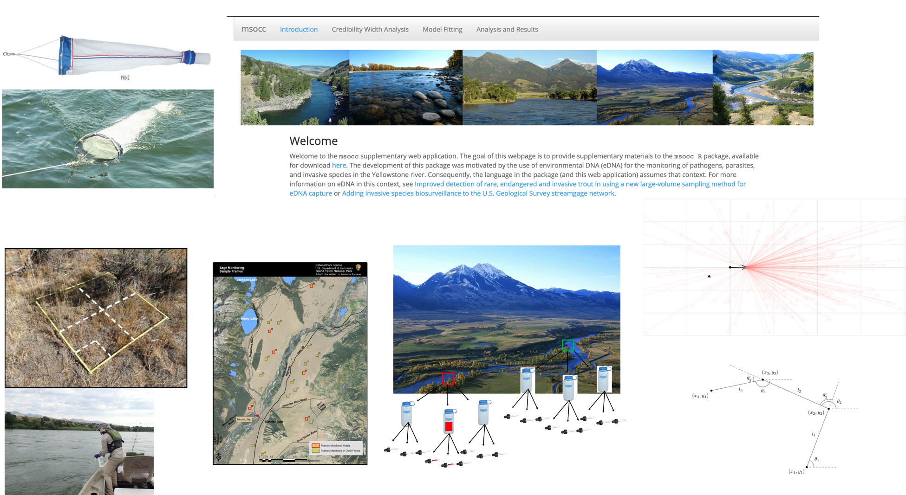
```

